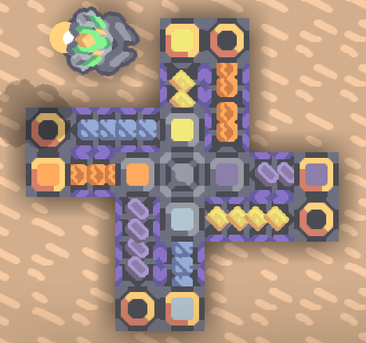

\>[Wiki](../../../zhcn.md)>[方块](../../blocks.md)>[运输](../distribution.md)>交叉器
# 交叉器
  
> 两条交叉传送带的桥梁.  

可以在四个方向上传输物品互不干扰,如图:

| 属性 | 数值 |  
| ---- | ---- |  
|ID|junction|
|生命值|30|  
|尺寸|1x1|  
|建造时间|0.1秒|  
|物品容量|6 任意物品 每个方向 (只有所对方向有己方建筑时才接受该方向输入)|  
|移动速度|15 物品/秒|  
| 材料消耗 | x2|
|阻挡地面单位|是|
|发光|否|
|可超速|是|
|enabled参数|控制是否运输物品|  
|config参数|无|
